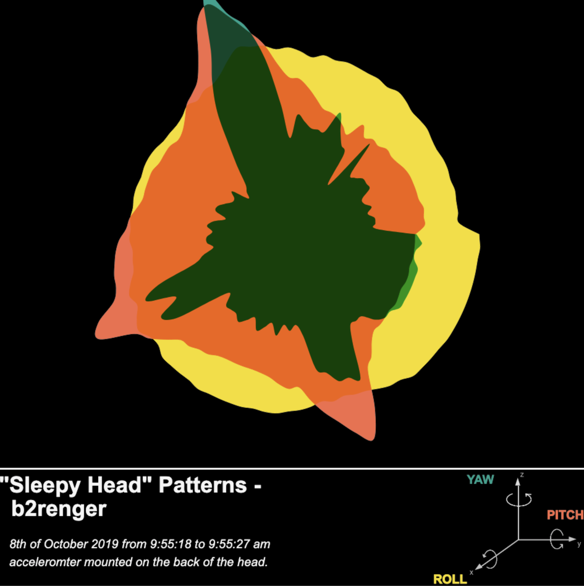
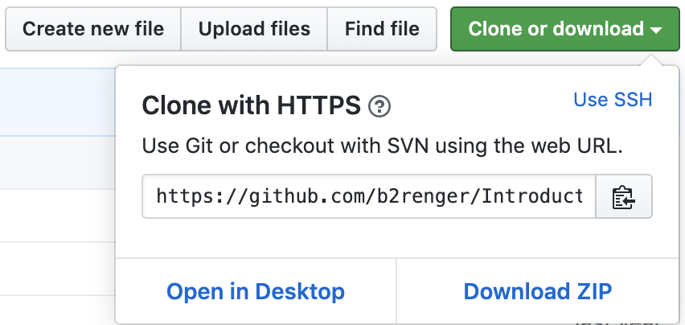
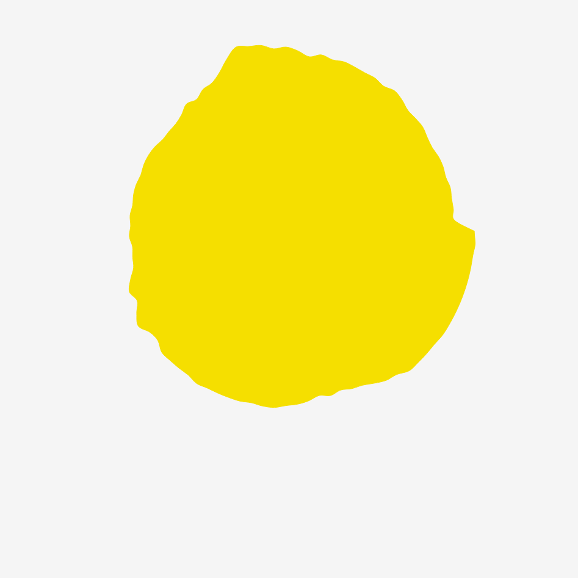
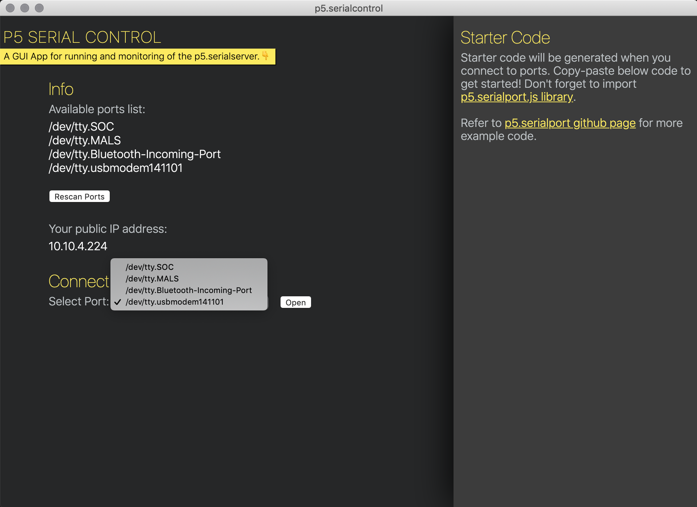

# p5js_gestes_de_l_ennui
This repo is a project for graphic designer as an introduction to p5js and arduino. The goal is to record data with arduino and visualize it with p5js.

Ce repo est un projet destiné à des designers graphique, servant d'introduction à p5js and arduino. 

L'objectif de ce projet est un travail sur la représentation de données : de la captation et l'impression.

Le sujet d'étude se portera sur la capatation de gestes du quotidien s'inscrivant dans une temporalité fugace porteur de la marque de l'ennui, afin de les enregistrer et les représenter dans le but de les péréniser via le processus de print.

Le résultat que nous chercherons à atteindre et celui-ci :



Les données vont être enregistrée à l'aide de circuits électroniques réalisés via [arduino](https://www.arduino.cc/), les données seront ensuite enregistrées et mises en forme à l'aide de [processing](https://processing.org/), puis interprétées et mises en image par l'intermédiaire de [p5js](https://p5js.org/) et de la bibliothèque [p5.riso](https://antiboredom.github.io/p5.riso/#ex) dédiée à la préparation d'image pour l'impression par [risographie](https://fr.wikipedia.org/wiki/Duplicopieur).

Il est d'ailleurs conseillé de se familiariser avec ces outils avant de se lancer dans ce tutorial :
- [Introduction à processing](https://github.com/b2renger/Introduction_Processing)
- [Introduction à arduino](https://github.com/b2renger/Introduction_Arduino)
- [Introduction à p5js](https://github.com/b2renger/Introduction_p5js)

Il n'est pas nécessaire de tout lire, mais il faut être familier avec les concepts de bases de ces différents langages qui ont beaucoup en commun.

Les prérequis sont :
- connaissances de bases en processing.
- avoir pris connaissance de l'introduction à arduino : avoir lu l'*introduction* ainsi le premier paragraphe de *connecter des capteurs et récupérer des valeurs*. Avoir regardé les différents gifs de cette section, afin de se représenter ce qu'il est possible de capter.
- avoir pris connaissance de l'introduction à p5js : lire l'introduction. Installer [visual studio code](https://code.visualstudio.com/) et réaliser les étapes (en tapant le code vous même): "comment travailler avec p5js" (spécifiquement la partie consacrée à visual studio code), "les principes de base", puis "dessiner avec la souris", "couleurs et transparence", "utilisation des variables", et "réaliser des symétries".

Les compétences travaillées sont les suivantes :
- processing : connaitre les principes de base (setup et draw, variables et fonctions), connection série, syntaxe JSON, écrire des fichiers sur le disque dur.
- arduino : connaitre les principes de base (entrées et sorties analogiques ou numériques, masse et 5V, branchements électroniques sur breadboard ), utilisations des bibliothèques, connection série syntaxe JSON.
- p5js : connaitre les principes de base (setup et draw, variables et fonctions), charger des données et récupérer des données formattées en JSON, réfléchir et mettre en oeuvre un système de représentation de données temporelles. Utilisation de la bibliothèque P5.RISO.


Vous pouvez télécharger l'ensemble de cette ressource en cliquant sur le petit bouton vert en haut à droite *clone and download*.



Une fois téléchargé vous pouvez décompresser le fichier et ajouter le dossier obtenu à votre workspace visual studio.

Bien sûr vous n'êtes absolument pas tenus à utiliser cette forme de visualisation : les capteurs que vous utiliserez, la façon dont vous les placerez et l'interprétation graphique des données que vous enregistrerez sont à votre discrétion. Il est cependant obligatoire de concevoir un cartel similaire à celui proposé dans cet exemple.  

Vous pouvez vous référer à ce site pour inspiration : https://informationisbeautiful.net/

Vous pouvez aussi consulter ces livres disponibles à l'atelier numérique :
- https://www.amazon.fr/gp/product/1472578309/ref=ppx_yo_dt_b_asin_title_o02_s01?ie=UTF8&psc=1
- https://www.amazon.fr/gp/product/2072792002/ref=ppx_yo_dt_b_asin_title_o02_s02?ie=UTF8&psc=1
- https://www.amazon.fr/gp/product/1473912148/ref=od_aui_detailpages01?ie=UTF8&psc=1


# Contenu

* [Captation des données](https://github.com/b2renger/p5js_gestes_de_l_ennui#captation-des-donn%C3%A9es)<br>
  * [Typologies des donnés et positionnement du capteur](https://github.com/b2renger/p5js_gestes_de_l_ennui#typologies-des-donn%C3%A9s-et-positionnement-du-capteur)<br>
  * [Circuit électronique](https://github.com/b2renger/p5js_gestes_de_l_ennui#circuit-%C3%A9lectronique)<br>
  * [Code arduino](https://github.com/b2renger/p5js_gestes_de_l_ennui#code-arduino)<br>
  * [Code processing et enregistrement des données](https://github.com/b2renger/p5js_gestes_de_l_ennui#code-processing-et-enregistrement-des-donn%C3%A9es)<br>
* [Représentation des données](https://github.com/b2renger/p5js_gestes_de_l_ennui#repr%C3%A9sentation-des-donn%C3%A9es)<br>
  * [Principes de base de p5.riso](https://github.com/b2renger/p5js_gestes_de_l_ennui#principes-de-base-de-p5riso)<br>
  * [Importer des données](https://github.com/b2renger/p5js_gestes_de_l_ennui#importer-des-donn%C3%A9es)<br>
  * [Créer un calque et représenter des données](https://github.com/b2renger/p5js_gestes_de_l_ennui#cr%C3%A9er-un-calque-et-repr%C3%A9senter-des-donn%C3%A9es)<br>
  * [Créer un fond](https://github.com/b2renger/p5js_gestes_de_l_ennui#cr%C3%A9er-un-fond)<br>
  * [Créer le cartel](https://github.com/b2renger/p5js_gestes_de_l_ennui#cr%C3%A9er-le-cartel)<br>
* [(Optionnel) visualiser des données en live !](https://github.com/b2renger/p5js_gestes_de_l_ennui#optionnel-visualiser-des-donn%C3%A9es-en-live-)<br>


# Captation des données

## Typologies des donnés et positionnement du capteur

L'axe choisi est de représenter les données issues des mouvement de la tête d'une personne en train de s'endormir, la captation sera faite à l'aide d'un accéleromètre attaché à la base du crane du sujet - derrière la tête, juste au niveau de l'Atlas. 

Il sera orienté de manière à ce que :
- l'axe X, traverser le crane en direction de la bouche.
- l'axe Y, parte en tangeante vers la gauche
- et l'axe Z monte vers le ciel.

Une ressource intéressante sera donc cette entrée dans le cours d'introduction à arduino :
https://github.com/b2renger/Introduction_arduino#acc%C3%A9l%C3%A9rom%C3%A8tre

[^home](https://github.com/b2renger/p5js_gestes_de_l_ennui#contenu)<br>

## Circuit électronique

Comme présenté dans l'introduction à arduino fournie en référence, le montage électronique devra s'effectuer comme suit :


[^home](https://github.com/b2renger/p5js_gestes_de_l_ennui#contenu)<br>

## Code arduino 

Le code de base fait appel à une bibliothèque *ADXL345*, (si vous avez besoin d'un rappel pour installer une bibliothèque : https://github.com/b2renger/Introduction_arduino#acc%C3%A9l%C3%A9rom%C3%A8tre)

Pour rappel nous utilisons le terme **Serial** pour désigner le port série de notre carte arduino ou ordinateur, cela est synonyme de port USB (Universal Serial Bus) : c'est le vecteur de communication entre notre carte arduino et notre ordinateur. Les données lues par la carte par le biais du capteurs sont ensuite postées (Serial.println()) sur le port série et donc récupérée par notre ordinateur et visualisé dans le moniteur ou traceur série du logcile arduino.

```c
// prévenir que nous allons avoir besoin de ces bibliothèques
#include <Wire.h>
#include <ADXL345.h>

ADXL345 accel; // on crée un objet qui nous permet de manipuler les données provenant de notre acceleromètre

void setup() {
  Serial.begin(9600);
  accel.powerOn(); // on active notre capteur
}

void loop() {

  // on crée trois variables pour stocker les valeurs brutes de notre acceleromètre.
  int x, y, z;
  accel.readXYZ(&x, &y, &z); //on lit données de l'accéleromètre et on les stockent dans nos variables.
  // on imprimme le résultat dans le moniteur série
  Serial.print("values of X , Y , Z: ");
  Serial.print(x);
  Serial.print(" , ");
  Serial.print(y);
  Serial.print(" , ");
  Serial.println(z);

  // on crée un tableau pour stocker les valeurs provenant du calcul effectué par notre bibliothèques quand on appel getAcceleration()
  double xyz[3]; 
  accel.getAcceleration(xyz); //on lit données de l'accéleromètre et on les stockent dans notre tableau
  // on imprimme le résultat
  Serial.print("X=");
  Serial.print(xyz[0]);
  Serial.print(" g , ");
  Serial.print("Y=");
  Serial.print(xyz[1]);
  Serial.print(" g , ");
  Serial.print("Z=");
  Serial.print(xyz[2]);
  Serial.println(" g");
  Serial.println("~~~~~~~~~~~~~~~~~~~~~~~~~~~~~~~~~~~~~~~~~~~~~~~~~~~~~~");
  //delay(500); // if you want to look in the monitor
  delay(10); // if you want to look in the tracer
}

```

Nous allons nous concentrer sur les données provenant de **getAcceleration()**, et allons donc supprimer pas mal d'éléments afin de simplifier notre code.

```c 
// prévenir que nous allons avoir besoin de ces bibliothèques
#include <Wire.h>
#include <ADXL345.h>


ADXL345 accel; // on crée un objet qui nous permet de manipuler les données provenant de notre acceleromètre

void setup() {
  Serial.begin(9600);
  accel.powerOn(); // on active notre capteur
}

void loop() {

  // on crée un tableau pour stocker les valeurs provenant du calcul effectué par notre bibliothèques quand on appelel getAcceleration()
  double xyz[3];
  accel.getAcceleration(xyz); //on lit données de l'accéleromètre et on les stockent dans notre tableau
 
  delay(100); // if you want to look in the tracer

}
```

Avec ce code plus rien n'est imprimé dans la console de notre arduino, nous allons donc nous attacher à formatter nos données afin au format JSON afin de pouvoir les transmettre à processing.

Nous allons écrire une chaîne de caractère au format [**JSON**](https://fr.wikipedia.org/wiki/JavaScript_Object_Notation) dans laquelle nous allons insérer une valeur lue sur notre entrée analogique.

Notre chaîne de caractère devra ressembler à cela
```json
{
    "x" : valeur_de_l_acceleration_sur_l_axe_X,
    "y" : valeur_de_l_acceleration_sur_l_axe_Y,
    "z" : valeur_de_l_acceleration_sur_l_axe_Z
}
```

Ce code arduino permet de faire cela avec la concaténation de chaîne de caractères.

```c
 String json;
  json = "{\"x\":";
  json = json + float(xyz[0]);
  json = json +";\"y\":";
  json = json +  float(xyz[1]);
  json = json +";\"z\":";
  json = json +  float(xyz[2]);
  json = json + "}";
```

Il ne nous reste plus qu'à écrire ces données sur notre port série afin de pouvoir les visualiser de nouveau.

```c
Serial.println(json);
```

Nous voici donc avec notre code arduino complet. Celui-ci permet de lire les données d'un accéléromètre et de les mettre en forme afin de pouvoir les exploiter dans processing.

[^home](https://github.com/b2renger/p5js_gestes_de_l_ennui#contenu)<br>

## Code processing et enregistrement des données

Du côté processing il faut maintenant s'atteler à recevoir cette chaîne de caractères, extraire les données et les enregistrer.

Il va nous falloir utiliser la bibliothèque [**Serial**](https://processing.org/reference/libraries/serial/index.html), il n'est pas nécessaire de l'installer car elle est integrée par défaut dans processing.

Il faut donc commencer par importer la bibliothèqe en tapant tout en haut du sketch 

```java
import processing.serial.*;
Serial myPort;  // Créer un objet serial pour pouvoir lire les information postées sur le port série
```

Ensuite nous devons ajouter quelques lignes au **setup()** : il faut au démarrage du programme initialiser la connexion série avec notre carte arduino.

```java
// initialisation de la communication via usb depuis arduino
// ATTENTION à bien utiliser le port adapté
printArray(Serial.list()); // imprimmer la liste des appreils connectés au port série
String portName = Serial.list()[3]; // ma carte arduino est la troisième dans la liste imprimmée dans la console
myPort = new Serial(this, portName, 9600); // on ouvre la communication
myPort.bufferUntil('\n');
```

Maitenant il nous faut exécuter du code à chaque fois qu'une information est postée sur le port série, cela se fait en l'écrivant dans une fonction : 
```java
void serialEvent (Serial myPort) {
  
}
```

Le code ci-dessous est un peu barbare, mais il n'est pas nécessaire de tout comprendre. En gros on va essayer de lire les données arrivant sur le port série, si celui-ci est ouvert, puis on va décrotiquer la chaine de caractère :

```java
void serialEvent (Serial myPort) {
  try { // on essaye de faire qqchose mais on ne plante pas si on y arrive pas
    while (myPort.available() > 0) {
      String inBuffer = myPort.readStringUntil('\n'); // lire la chaine de caractère du port série jusqu'au retour charriot
      if (inBuffer != null) { // si ce n'est pas nul
        if (inBuffer.substring(0, 1).equals("{")) { // et si ça ressemble à du json
          JSONObject json = parseJSONObject(inBuffer); // on essaye de le lire comme du json
          // C'est à partir de là qu'il faut comprendre !!
          if (json == null) { // si ce n'est pas du json on fait rien
            
          }
          else { // sinon on peut enfin faire des trucs !


            
          }
        // il ne nous reste plus qu'à fermer toutes nos accolades ^^
        } 
        else {
        }
      }
    }
  } 
  catch (Exception e) {
  }
}
```
Il y a pas mal de tests de sécurité pour éviter que notre programme plante si notre chaîne est nulle ou si la donnée que l'on cherche n'est pas disponible.

Il nous faut maintenant nous occuper de l'enregistrement sur le disque dur.

Tout d'abord il nous faut un fichier texte vide appelé **data.json** dans un dossier /data situé à l'endroit ou votre programme processing est sauvegardé. En réalité il ne doit pas être complétement vide mais juste contenir une accolade ouvrante et une accolade fermante :

```json
{}
```
cela correspond à la structure de base d'un fichier json.

Après avoir récupéré les données depuis la chaîne de caractère au format json depuis l'arduino et ce toujours dans la fonction *void serialEvent(Serial myPort)*

```java
// récupérer les données stockée dans le format json transmis via usb
float x    = json.getFloat("x");
float y    = json.getFloat("y");
float z    = json.getFloat("z");
```

Nous allons pouvoir procéder à l'enregistrement :
- d'abord nous devons charger notre fichier json (pour l'instant vide)
  ```java
  JSONArray js  = loadJSONArray("data.json"); // on charge le fichier data.json - dans lequel on va ajouter une entrée
  ```

- ensuite nous allons créer un nouvel objet json que nous allons renseigner avec de nouvelles données
  ```java
    JSONObject njs = new JSONObject(); // on crée un nouvel objet json
            // on ajoute un timestamp avec date et heure
    JSONObject njs = new JSONObject();
    njs.setString("timestamp", year()+"-"+month()+"-"+day()+"-"+hour()+"-"+minute()+"-"+second()+"-"+millis());
    njs.setFloat("x", x);
    njs.setFloat("y", y);
    njs.setFloat("z", z);
  ```

- puis nous allons ajouter ce nouvel objet à notre fichier chargé à l'étape 1.
  ```java
  js.append(njs); // on ajoute ce nouvel objet à l'objet chargé précédement
  ```

- enfin nous sauvegardons le tout sur notre disque dur
  ```java
  saveJSONArray(js, "data/data.json"); // on sauvegarde le tout en écrasant le fichier précédent.
  ```
A chaque fois que des données sont reçues nous rechargeons le fichier, ajoutons des données et écrasons le fichier précédent : au fur et à mesure nous stockons donc toutes les données envoyées par arduino.

Après avoir réalisé un enregistrement, il faut bien penser à renommer le fichier *data.json* avec un nom équivoque et à recréer un fichier vide si l'on veut relancer un enregistrement.

[^home](https://github.com/b2renger/p5js_gestes_de_l_ennui#contenu)<br>

# Représentation des données
P5js est très proche de processing. Nous n'allons donc pas rentrer dans les détails du fonctionnement de p5js.


## Principes de base de p5.riso

Dans le dossier *visualisation_template*, vous trouverez un système de fichier comprenant :
- un dossier nommé lib comprenant les bibliothèques nécessaires à votre travail.
- un fichier index.html, comprenant les principaux éléments de css, le titre de votre page et les liens vers les bibliothèques utilisées.
- un fichier sketch.js qui va contenir votre code. Celui est pour l'instant uniquement rempli avec les différentes fonctions que nous utiliserons, mais il ne fait rien du tout.

Vous pouvez copier/coller ce dossier pour créer votre propre projet.

Voici le contenu du fichier **sketch.js**

```js
// permet de précharger des fichiers (comme nos données ou éventuellement des images)
function preload() {
  
}

// fonction exécutée une seule fois au démarrage de notre programme
function setup() {
  createCanvas(windowHeight, windowHeight); // on crée un espace de dessin <=> size()
  pixelDensity(1) // nécessaire pour la bibliothèque riso
}

function draw() {
  background(255);
  // ces trois fonctions sont nécessaires à la bibliothèque riso
  clearRiso(); // remove everything
  drawViz(); // draw each viz in its layer => nous allons écrire notre code dans cette fonction
  drawRiso(); // display the layers drawn previously
}

function drawViz() {
    // c'est ici que nous allons écrire la plus grosse partie de notre code.


}

// exporter nos fichiers pour le print lorsque nous appuyons sur la souris.
function mouseClicked() {
  exportRiso();
}
```
D'un point de vue très pragmatique, la bibliothèques p5.riso fonctionne avec un système de calques.
Nous définirons donc des objets permettant de dessiner différents éléments dans un calque à l'aide des fonction de dessin de base de processing ou p5js. Lorsque nous cliquerons sur la souris, la bibliothèque p5.riso effectuera un export : pour un chaque calque un png sera téléchargé et pourra ensuite être utilisé en risographie ou en sérigraphie.

A noter que dans le cadre de l'utilisation de p5.riso, l'utilisation des fonctions **fill()** et **stroke()** sont un peu différentes. Ici il ne sera pas possible de spécifier une couleur étant donné que nous allons dessiner dans un calque spécifique et que c'est ce calque qui définira la couleur des éléments que nous dessinerons. Ces deux fonction prendront donc comme paramètre une valeur entre 0 et 255 qui correspondra à un niveau de transaprence - 0 étant totalement transparent et 255 complétement opaque.
- https://antiboredom.github.io/p5.riso/#fill
- https://antiboredom.github.io/p5.riso/#stroke

[^home](https://github.com/b2renger/p5js_gestes_de_l_ennui#contenu)<br>

## Importer des données.

Nous allons tout de suite nous attacher à importer les données enregistrées à l'étape précédente.

Pour cela nous devons d'abord créer une variable - en javascript les variables ne sont pas typées. Adieu donc les *int*, *float*, *string* etc. toutes nos variables auront le même type *let* - cela peut aussi bien avoir des avantages que des inconvénients.

Créeons donc avant le setup() une première variable qui nous permettera de stocker et donc d'accéder à nos données.

```js
let data
```

Nous allons donc charger nos données dans cet objet, et nous allons le faire dans la fonction **preload()** qui est destinée à gérer le chargement de tous les éléments dont pourrions avoir besoin dans notre programe.

```js
function preload() {
  data = loadJSON("data.json", function () {
    console.log("done")
  })
```
Nous appelons donc la fonction [loadJson()](https://p5js.org/reference/#/p5/loadJSON), cette fonction va donc charger des données au format JSON dans notre objet data. Elle va charger le fichier que nous passons en tant que premier paramètre (le fichier *data.json* qui doit être rangé dans le même dossier que nos fichiers *index.html* et *sketch.js*), le second paramètre est une fonction javascript qui s'éxecutera quand le chargement sera fini (ici elle imprime dans la console du navigateur le mot "done")- ce type de fonction s'appelle une fonction **callback** et est très utilisée en javascript, elle ne porte pas de nom et est donc désignée comme une fonction anonyme.

Si le chargement de notre fichier a réussi, il est donc possible de le vérifier dans la [console javascript de votre navigateur](https://lucidchart.zendesk.com/hc/fr/articles/207323676-Comment-ouvrir-la-console-JavaScript). Si un message apparait, il est possible d'imprimer d'autres choses comme par exemple, le nombre d'entrées de notre fichier *data.json*, ou le premier élément.

```js
function preload() {
  data = loadJSON("data.json", function () {
    console.log("done")
    console.log(Object.keys(data).length) // nombre d'entrées
    console.log(data[0]) // première entrée de notre fichier
    console.log(data[0].timestamp) // timestamp du premier point enregistré
    console.log(data[1].x) // valeur "x" du deuxième point enregistré
  })
```
On peut donc accéder aux différents points enregistrés en utilisants les crochets **'['** et **']'** en indiquant à l'intérieur l'index du point qui nous intéresse; ainsi qu'au différentes valeurs de chaque point en utilisant l'accesseur **'.'**. Celui-ci doit être suivi d'un chaîne de caractère correspondant à une entrée de notre fichier JSON (dans notre cas 'x', 'y', 'z' ou 'timestamp').

[^home](https://github.com/b2renger/p5js_gestes_de_l_ennui#contenu)<br>

## Créer un calque et représenter des données.

Nous allons donc créer notre premier calque pour représenter les données issues de l'axe X de notre accéléromètre.

**Avant le setup()** nous allons créer une nouvelle variable :
```js
let layerX;
```

**Dans le setup()** nous allons l'initialiser comme étant un calque de la bibliothèque riso ayant pour couleur le jaune.

```js
function setup() {
  createCanvas(windowHeight, windowHeight);
  pixelDensity(1)

  layerX = new Riso('yellow');
}
```
Nous pouvons maintenant dessiner dedans. Nous allons faire cela à l'intérieur de la fonction **drawViz()**. 
Nous allons représenter nos données de manière radiale, et pour cela nous allons utiliser les [coordonnées polaires](https://fr.wikipedia.org/wiki/Coordonn%C3%A9es_polaires)
Pour résumer alors que dans notre système classique - cartésien de coordonnées nous utilisons l'abscisse et l'ordonnée d'un point pour définir sa position dans le plan, il est aussi possible d'utiliser un angle et un rayon. Comme illustré ici : https://www.openprocessing.org/sketch/151087

Dans notre cas nous allons donc faire en sorte que l'index de nos points soit transformé en une valeur d'angle pour parcourir un tour complet d'un cercle et la valeur mesurée sera transformée en un rayon pour qu'en fonction de cette valeur notre point soit plus éloigné ou moins éloigné du centre.

En terme de code il faudra cependant tranformer ces valeurs en positions cartésiennes afin de les positionner avec processing, mais il ne s'agit là que de l'application de formule mathématiques :

```
X = abscisse_du_centre + rayon x cosinus (angle)
Y = ordonnée_du_centre + rayon x sinus (angle)
```
Le but est d'obtenir ce type de forme : 


A l'intérieur de **drawViz()**, nous allons donc commencer par créer une variable qui contiendra le nombre de points que nous avons à représenter.

```js
function drawViz() {
    let dataSize = Object.keys(data).length;
}
```
Nous allons donc maintenant pouvoir créer une boucle **for()** pour parcourir tous les points enregistrés précédement :

```js
for (let i = 0; i < dataSize; i++) {
    
}
```
et nous pourrons donc utiliser la fonction **[map()](https://p5js.org/reference/#/p5/map)** pour calculer les coordonnées de nos points ... nous transformons :
- les données de l'accéléromètre *data[i].x* qui sont comprises entre -1 et 1 en une valeur qui sera interprétée comme un rayon et comprise entre 25 pixels et environ la moitié de la hauteur de notre dessin.
- l'index du point que nous traitons qui est compris entre 0 et dataSize, en une valeur qui sera interprétée comme un angle et donc comprise entre 0 et 2xPI radians (pour faire le tour complet du cercle).

```js
layerX.fill(255); // dessiner nos formes avec un remplissage opaque
for (let i = 0; i < dataSize; i++) {
    let r = map(data[i].y, -1, 1, 25, height * 0.45) // données de l'accéléromètre
    let angle = map(i, 0, dataSize, 0, TWO_PI) // index du point.
    let x = width * 0.5 + r * cos(angle) // abscisse calculée par application de la formule
    let y = height * 0.4 + r * sin(angle) // ordonnée calculée par application de la formule
    layerX.ellipse(x, y,5,5)
}
```

Pour l'instant, nous avons dessiné des cercles pour chaque point, mais nous voulons dessiner une forme pleine et nous allons pour cela utiliser des **[curveVertex()](https://p5js.org/reference/#/p5/curveVertex)**

```js
layerX.fill(255); // dessiner nos formes avec un remplissage opaque
layerX.beginShape();
for (let i = 0; i < dataSize; i++) {
    let r = map(data[i].y, -1, 1, 25, height * 0.45) // données de l'accéléromètre
    let angle = map(i, 0, dataSize, 0, TWO_PI) // index du point.
    let x = width * 0.5 + r * cos(angle) // abscisse calculée par application de la formule
    let y = height * 0.4 + r * sin(angle) // ordonnée calculée par application de la formule
    layerX.curveVertex(x, y)
}
layerX.endShape();
```

Une fois cela fait, il est assez simple de reproduire ce procédé 3 fois afin d'obtenir les dessins issus des données des 3 axes de l'accéléromètre chacun dans un calque de couleur différent.

[^home](https://github.com/b2renger/p5js_gestes_de_l_ennui#contenu)<br>

## Créer un fond

Créer un fond est assez simple : il s'agit simplement de créer un calque noir vide. On crée une variable **avant le setup()** :

```js
let back;
```

**Dans le setup()** on l'initialise comme un calque noir :

```js
back = new Riso('black')
```

Enfin dans la fonction **drawViz()**, on dessine un rectangle noir opaque couvrant toute notre zone de dessin 

```js
back.fill(255)
back.rect(0,0,width,height)
```

En faisant cela cependant nous recouvrons toute notre visualisation de noir, il faut utiliser la fonction **[cutout()](https://antiboredom.github.io/p5.riso/#cutout)** pour réaliser des découpes et laisser apparaitre nos autres calques. Cette opération est à réaliser à la toute fin de notre process de dessin : quand toutes les formes ont été dessinées

```js
back.cutout(layerX)
```
[^home](https://github.com/b2renger/p5js_gestes_de_l_ennui#contenu)<br>

## Créer le cartel

Le cartel va être produit de la même manière que les autres calques, il sera crée dans un calque blanc nommé 'info'

```js
let info
// (...)

function setup(){
    // (...)
    info = new Riso('white')
    // (...)
}
```

Ici les choses seront plus normées, car les différents cartels devront être identiques. Il est séparé de votre image par une ligne de 3px :

```js
info.stroke(255);
info.strokeWeight(3);
info.line(0, height * 0.8, width, height * 0.8);
```

Il doit comporter le nom de votre image, en Arial bold 36, suivi de vos noms :

```js
info.noStroke();
info.fill(255);
info.textStyle(BOLD);
info.textFont('Arial');
info.textAlign(LEFT, CENTER);
info.textSize(36);
info.text('"Sleepy Head" Patterns -', 0, height * 0.83);
info.text('  b2renger', 0, height * 0.87);
```

Dessous doit être indiqué en italic 20, la manière dont vous avez mesuré les données et la durée de la mesure.

```js
info.textSize(20);
info.textStyle(ITALIC);
info.text('   8th of October 2019 from 9:55:18 to 9:55:27 am', 0, height * 0.93);
info.text('   acceleromter mounted on the back of the head.', 0, height * 0.96);
```
Il peut être nécessaire d'utiliser l'espace restant à droite pour inclure une légende nécessaire à la compréhension de votre image.

Vous avez maintenant tous les éléments nécessaires pour réaliser votre projet, vous pouvez consulter le code de l'image réalisée [ici](visualisation/sketch.js).

[^home](https://github.com/b2renger/p5js_gestes_de_l_ennui#contenu)<br>

# (Optionnel) visualiser des données en live !

Il est bien sûr possible d'avoir une connection directe en votre carte arduino et votre programme p5js afin de visualiser les données en direct.

Pour cela il est nécessaire de disposer de l'application [p5.serialcontrol](https://github.com/p5-serial/p5.serialcontrol/releases) pour votre système d'exploitation.

Ensuite il faut avoir :
- une carte arduino avec le programme téléversé et connectée en usb
- l'application p5.serialcontrol lancée et ce avec le bon port sélectionné

- la page web *visualisation_live* d'ouverte dans votre navigateur via le serveur web de vscode studio.

Le [code](visualisation_live/sketch.js) est normalement suffisament commenté pour que vous puissiez comprendre ce qu'il s'y passe .

Si tous ces éléments sont réunis vous devriez voir apparaitre le résultat de vos mesure actualisé en live. 

[^home](https://github.com/b2renger/p5js_gestes_de_l_ennui#contenu)<br>


