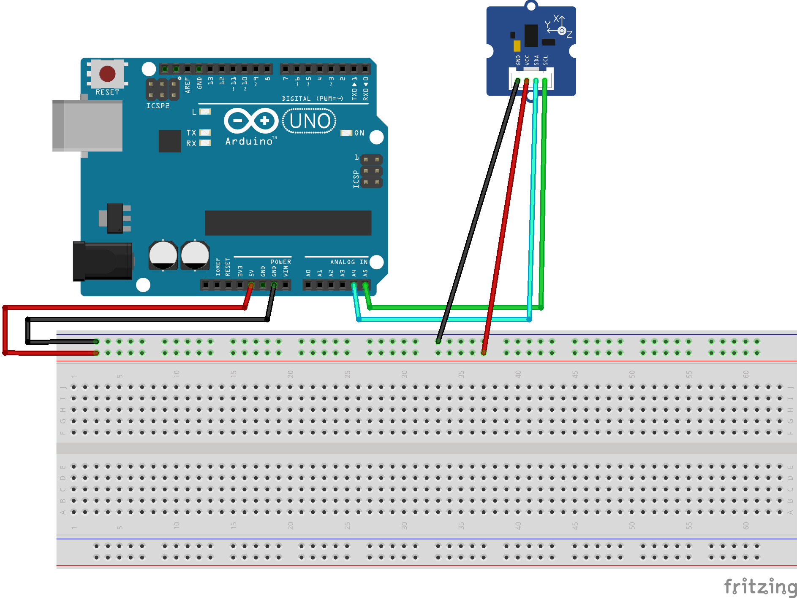

# p5js_gestes_de_l_ennui
This repo is a project for graphic designer as an introduction to p5js and arduino. The goal is to record data with arduino and visualize it with p5js.

L'objectif de ce projet est un travail sur la représentation de données : de la captation et l'impression.

Le sujet d'étude se portera sur la capatation de gestes du quotidien s'inscrivant dans une temporalité fugace porteur de la marque de l'ennui, afin de les enregistrer et les représenter dans le but de les péréniser via le processus de print.

Les données vont être enregistrée à l'aide de circuits électroniques réalisés via [arduino](https://www.arduino.cc/), les données seront ensuite enregistrées et mises en forme à l'aide de [processing](https://processing.org/), puis interprétées et mises en image par l'intermédiaire de [p5js](https://p5js.org/) et de la bibliothèque [p5.riso](https://antiboredom.github.io/p5.riso/#ex) dédiée à la préparation d'image pour l'impression par [risographie](https://fr.wikipedia.org/wiki/Duplicopieur).

Il est d'ailleurs conseillé de se familiariser avec ces outils avant de se lancer dans ce tutorial :
- [Introduction à processing](https://github.com/b2renger/Introduction_Processing)
- [Introduction à arduino](https://github.com/b2renger/Introduction_Arduino)
- [Introduction à p5js](https://github.com/b2renger/Introduction_p5js)

Il n'est pas nécessaire de tout lire, mais il faut être familier avec les concepts de bases de ces différents langages qui ont beaucoup en commun.

Les prérequis sont :
- connaissances de bases en processing.
- avoir pris connaissance de l'introduction à arduino : avoir lu l'*introduction* ainsi le premier paragraphe de *connecter des capteurs et récupérer des valeurs*. Avoir regardé les différents gifs de cette section, afin de se représenter ce qu'il est possible de capter.
- avoir pris connaissance de l'introduction à p5js : lire l'introduction. Installer [visual studio code](https://code.visualstudio.com/) et réaliser les étapes (en tapant le code vous même): "comment travailler avec p5js" (spécifiquement la partie consacrée à visual studio code), "les principes de base", puis "dessiner avec la souris", "couleurs et transparence", "utilisation des variables", et "réaliser des symétries".

Les compétences travaillées sont les suivantes :
- processing : connaitre les principes de base (setup et draw, variables et fonctions), connection série, syntaxe JSON, écrire des fichiers sur le disque dur.
- arduino : connaitre les principes de base (entrées et sorties analogiques ou numériques, masse et 5V, branchements électroniques sur breadboard ), utilisations des bibliothèques, connection série syntaxe JSON.
- p5js : connaitre les principes de base (setup et draw, variables et fonctions), charger des données et récupérer des données formattées en JSON, réfléchir et mettre en oeuvre un système de représentation de données temporelles. Utilisation de la bibliothèque P5.RISO.

Le résultat que nous chercherons à atteindre et celui-ci :


Vous pouvez télécharger l'ensemble de cette ressource en cliquant sur le petit bouton vert en haut à droite *clone and download*


Une fois télécharger vous pouvez décompresser le fichier et ajouter le dossier obtenu à votre workspace visual studio.

# Captation des données

## Typologies des donnés et positionnement du capteur

L'axe choisi est de représenter les données issues des mouvement de la tête d'une personne en train de s'endormir, la captation sera faite à l'aide d'un accéleromètre attaché à la base du crane du sujet - derrière la tête, juste au niveau de l'Atlas. 

Il sera orienté de manière à ce que :
- l'axe X, traverser le crane en direction de la bouche.
- l'axe Y, parte en tangeante vers la gauche
- et l'axe Z monte vers le ciel.

Une ressource intéressante sera donc cette entrée dans le cours d'introduction à arduino :
https://github.com/b2renger/Introduction_arduino#acc%C3%A9l%C3%A9rom%C3%A8tre


## Circuit électronique

Comme présenté dans l'introduction à arduino fournie en référence, le montage électronique devra s'effectuer comme suit :



## Code arduino 

Le code de base fait appel à une bibliothèque *ADXL345*, (si vous avez besoin d'un rappel pour installer une bibliothèque : https://github.com/b2renger/Introduction_arduino#acc%C3%A9l%C3%A9rom%C3%A8tre)

Pour rappel nous utilisons le terme **Serial** pour désigner le port série de notre carte arduino ou ordinateur, cela est synonyme de port USB (Universal Serial Bus) : c'est le vecteur de communication entre notre carte arduino et notre ordinateur. Les données lues par la carte par le biais du capteurs sont ensuite postées (Serial.println()) sur le port série et donc récupérée par notre ordinateur et visualisé dans le moniteur ou traceur série du logcile arduino.

```c
// prévenir que nous allons avoir besoin de ces bibliothèques
#include <Wire.h>
#include <ADXL345.h>

ADXL345 accel; // on crée un objet qui nous permet de manipuler les données provenant de notre acceleromètre

void setup() {
  Serial.begin(9600);
  accel.powerOn(); // on active notre capteur
}

void loop() {

  // on crée trois variables pour stocker les valeurs brutes de notre acceleromètre.
  int x, y, z;
  accel.readXYZ(&x, &y, &z); //on lit données de l'accéleromètre et on les stockent dans nos variables.
  // on imprimme le résultat dans le moniteur série
  Serial.print("values of X , Y , Z: ");
  Serial.print(x);
  Serial.print(" , ");
  Serial.print(y);
  Serial.print(" , ");
  Serial.println(z);

  // on crée un tableau pour stocker les valeurs provenant du calcul effectué par notre bibliothèques quand on appel getAcceleration()
  double xyz[3]; 
  accel.getAcceleration(xyz); //on lit données de l'accéleromètre et on les stockent dans notre tableau
  // on imprimme le résultat
  Serial.print("X=");
  Serial.print(xyz[0]);
  Serial.print(" g , ");
  Serial.print("Y=");
  Serial.print(xyz[1]);
  Serial.print(" g , ");
  Serial.print("Z=");
  Serial.print(xyz[2]);
  Serial.println(" g");
  Serial.println("~~~~~~~~~~~~~~~~~~~~~~~~~~~~~~~~~~~~~~~~~~~~~~~~~~~~~~");
  //delay(500); // if you want to look in the monitor
  delay(10); // if you want to look in the tracer
}

```

Nous allons nous concentrer sur les données provenant de **getAcceleration()**, et allons donc supprimer pas mal d'éléments afin de simplifier notre code.

```c 
// prévenir que nous allons avoir besoin de ces bibliothèques
#include <Wire.h>
#include <ADXL345.h>


ADXL345 accel; // on crée un objet qui nous permet de manipuler les données provenant de notre acceleromètre

void setup() {
  Serial.begin(9600);
  accel.powerOn(); // on active notre capteur
}

void loop() {

  // on crée un tableau pour stocker les valeurs provenant du calcul effectué par notre bibliothèques quand on appelel getAcceleration()
  double xyz[3];
  accel.getAcceleration(xyz); //on lit données de l'accéleromètre et on les stockent dans notre tableau
 
  delay(100); // if you want to look in the tracer

}
```

Avec ce code plus rien n'est imprimé dans la console de notre arduino, nous allons donc nous attacher à formatter nos données afin au format JSON afin de pouvoir les transmettre à processing.

Nous allons écrire une chaîne de caractère au format [**JSON**](https://fr.wikipedia.org/wiki/JavaScript_Object_Notation) dans laquelle nous allons insérer une valeur lue sur notre entrée analogique.

Notre chaîne de caractère devra ressembler à cela
```json
{
    "x" : valeur_de_l_acceleration_sur_l_axe_X,
    "y" : valeur_de_l_acceleration_sur_l_axe_Y,
    "z" : valeur_de_l_acceleration_sur_l_axe_Z
}
```

Ce code arduino permet de faire cela avec la concaténation de chaîne de caractères.

```c
 String json;
  json = "{\"x\":";
  json = json + float(xyz[0]);
  json = json +";\"y\":";
  json = json +  float(xyz[1]);
  json = json +";\"z\":";
  json = json +  float(xyz[2]);
  json = json + "}";
```

Il ne nous reste plus qu'à écrire ces données sur notre port série afin de pouvoir les visualiser de nouveau.

```c
Serial.println(json);
```

Nous voici donc avec notre code arduino complet. Celui-ci permet de lire les données d'un accéléromètre et de les mettre en forme afin de pouvoir les exploiter dans processing.

## Code processing et enregistrement des données

Du côté processing il faut maintenant s'atteler à recevoir cette chaîne de caractères, extraire les données et les enregistrer.

Il va nous falloir utiliser la bibliothèque [**Serial**](https://processing.org/reference/libraries/serial/index.html), il n'est pas nécessaire de l'installer car elle est integrée par défaut dans processing.

Il faut donc commencer par importer la bibliothèqe en tapant tout en haut du sketch 

```java
import processing.serial.*;
Serial myPort;  // Créer un objet serial pour pouvoir lire les information postées sur le port série
```

Ensuite nous devons ajouter quelques lignes au **setup()** : il faut au démarrage du programme initialiser la connexion série avec notre carte arduino.

```java
// initialisation de la communication via usb depuis arduino
// ATTENTION à bien utiliser le port adapté
printArray(Serial.list()); // imprimmer la liste des appreils connectés au port série
String portName = Serial.list()[3]; // ma carte arduino est la troisième dans la liste imprimmée dans la console
myPort = new Serial(this, portName, 9600); // on ouvre la communication
myPort.bufferUntil('\n');
```

Maitenant il nous faut exécuter du code à chaque fois qu'une information est postée sur le port série, cela se fait en l'écrivant dans une fonction : 
```java
void serialEvent (Serial myPort) {
  
}
```

Le code ci-dessous est un peu barbare, mais il n'est pas nécessaire de tout comprendre. En gros on va essayer de lire les données arrivant sur le port série, si celui-ci est ouvert, puis on va décrotiquer la chaine de caractère :

```java
void serialEvent (Serial myPort) {
  try { // on essaye de faire qqchose mais on ne plante pas si on y arrive pas
    while (myPort.available() > 0) {
      String inBuffer = myPort.readStringUntil('\n'); // lire la chaine de caractère du port série jusqu'au retour charriot
      if (inBuffer != null) { // si ce n'est pas nul
        if (inBuffer.substring(0, 1).equals("{")) { // et si ça ressemble à du json
          JSONObject json = parseJSONObject(inBuffer); // on essaye de le lire comme du json
          // C'est à partir de là qu'il faut comprendre !!
          if (json == null) { // si ce n'est pas du json on fait rien
            
          }
          else { // sinon on peut enfin faire des trucs !


            
          }
        // il ne nous reste plus qu'à fermer toutes nos accolades ^^
        } 
        else {
        }
      }
    }
  } 
  catch (Exception e) {
  }
}
```
Il y a pas mal de tests de sécurité pour éviter que notre programme plante si notre chaîne est nulle ou si la donnée que l'on cherche n'est pas disponible.

Il nous faut maintenant nous occuper de l'enregistrement sur le disque dur.

Tout d'abord il nous faut un fichier texte vide appelé **data.json** dans un dossier /data situé à l'endroit ou votre programme processing est sauvegardé. En réalité il ne doit pas être complétement vide mais juste contenir une accolade ouvrante et une accolade fermante :

```json
{}
```
cela correspond à la structure de base d'un fichier json.

Après avoir récupéré les données depuis la chaîne de caractère au format json depuis l'arduino et ce toujours dans la fonction *void serialEvent(Serial myPort)*

```java
// récupérer les données stockée dans le format json transmis via usb
float x    = json.getFloat("x");
float y    = json.getFloat("y");
float z    = json.getFloat("z");
```

Nous allons pouvoir procéder à l'enregistrement :
- d'abord nous devons charger notre fichier json (pour l'instant vide)
  ```java
  JSONArray js  = loadJSONArray("data.json"); // on charge le fichier data.json - dans lequel on va ajouter une entrée
  ```

- ensuite nous allons créer un nouvel objet json que nous allons renseigner avec de nouvelles données
  ```java
    JSONObject njs = new JSONObject(); // on crée un nouvel objet json
            // on ajoute un timestamp avec date et heure
    JSONObject njs = new JSONObject();
    njs.setString("timestamp", year()+"-"+month()+"-"+day()+"-"+hour()+"-"+minute()+"-"+second()+"-"+millis());
    njs.setFloat("x", x);
    njs.setFloat("y", y);
    njs.setFloat("z", z);
  ```

- puis nous allons ajouter ce nouvel objet à notre fichier chargé à l'étape 1.
  ```java
  js.append(njs); // on ajoute ce nouvel objet à l'objet chargé précédement
  ```

- enfin nous sauvegardons le tout sur notre disque dur
  ```java
  saveJSONArray(js, "data/data.json"); // on sauvegarde le tout en écrasant le fichier précédent.
  ```
A chaque fois que des données sont reçues nous rechargeons le fichier, ajoutons des données et écrasons le fichier précédent : au fur et à mesure nous stockons donc toutes les données envoyées par arduino.

Après avoir réalisé un enregistrement, il faut bien penser à renommer le fichier *data.json* avec un nom équivoque et à recréer un fichier vide si l'on veut relancer un enregistrement.

# Représentation des données


